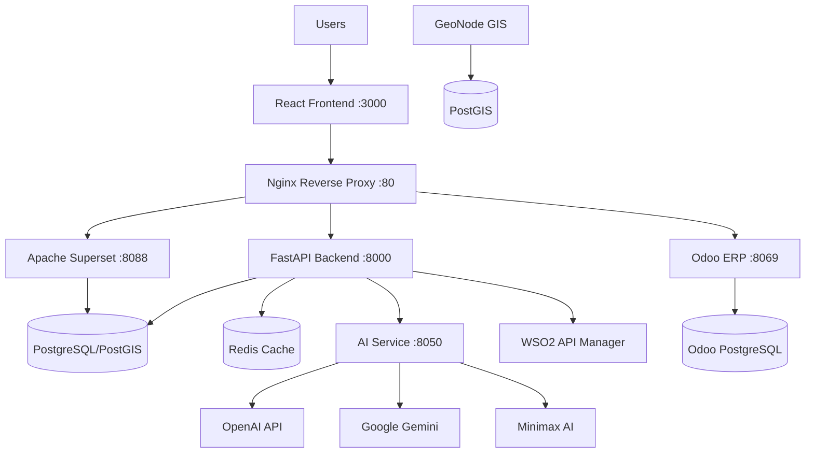
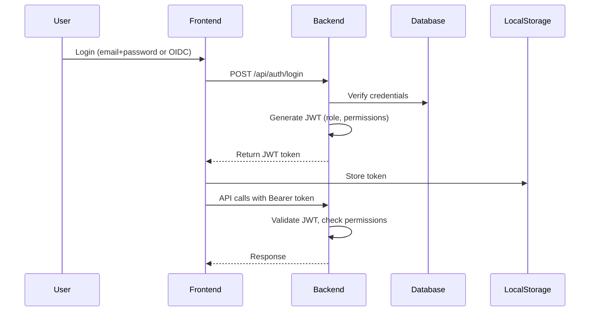
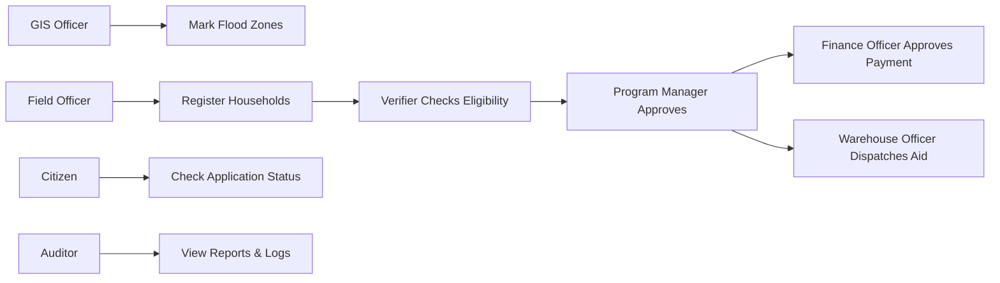
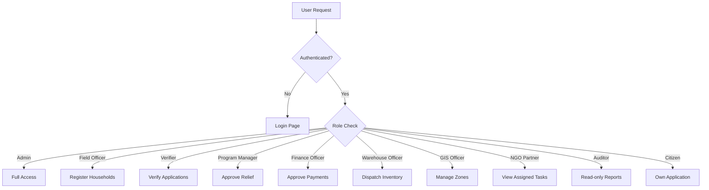
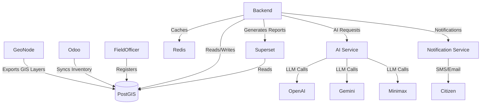

# GovRecover360 - System Architecture

## Architecture Overview

GovRecover360 employs a microservices architecture deployed via Docker Compose. The platform consists of eight core services plus supporting infrastructure. Each service runs in its own container and communicates over a shared Docker network. The Nginx reverse proxy serves as the single entry point for all HTTP traffic, routing requests to the appropriate service based on URL path.

## High-Level Architecture



### Component Descriptions

| Component | Technology | Purpose |
|---|---|---|
| React Frontend | React 18, TypeScript, Vite | Single-page application providing role-based dashboards for all user types |
| Nginx Reverse Proxy | Nginx Alpine | Routes traffic to appropriate services, handles CORS, security headers, and SSL termination |
| FastAPI Backend | Python 3.11, FastAPI | Core business logic, REST API, authentication, RBAC enforcement, data persistence |
| PostgreSQL/PostGIS | PostGIS 15 | Primary data store with geospatial extensions for GIS operations |
| Redis Cache | Redis 7 | Session caching, rate limiting, temporary data storage |
| AI Service | Python, FastAPI | LLM-powered features with pluggable provider architecture |
| Odoo ERP | Odoo 17 | Financial management, procurement, HR, and logistics modules |
| Apache Superset | Apache Superset | Analytics dashboards, SQL Lab, scheduled reports |
| WSO2 API Manager | WSO2 APIM | API governance, rate limiting, OAuth2 token validation, analytics |
| GeoNode GIS | GeoNode | Geospatial data management, map visualization, layer publishing |

## Authentication Flow



The platform supports two authentication modes:

1. **Local Authentication** - The backend verifies email/password against the users table, generates a JWT containing user ID, email, role, and permissions list. The JWT is signed with HS256 using the configured SECRET_KEY.

2. **OIDC Authentication (Asgardeo)** - Users authenticate via Asgardeo's OIDC provider. The frontend redirects to Asgardeo's login page, receives an ID token, and exchanges it with the backend for a platform JWT.

## Disaster Recovery Workflow



The disaster recovery workflow follows a sequential pipeline:

1. **GIS Officer** maps affected zones using GeoNode
2. **Field Officer** registers affected households with damage assessments
3. **Citizen** (or Field Officer) submits a relief application
4. **Verifier** reviews documentation and verifies eligibility
5. **Program Manager** approves relief allocation
6. **Finance Officer** approves payment disbursement
7. **Warehouse Officer** dispatches physical aid items
8. **NGO Partner** delivers aid to the household
9. **Citizen** tracks application status
10. **Auditor** reviews reports and audit logs

## Role-Based Access Control (RBAC)



The RBAC system enforces access control at two levels:

- **Middleware Level** - The RBACMiddleware extracts JWT claims (role, permissions) on every request and attaches them to `request.state`
- **Dependency Level** - Route handlers use `require_permission()` and `require_role()` FastAPI dependencies to enforce granular access
- Admin users bypass all role checks and have full system access

## Data Flow



## Security Architecture

### Authentication & Authorization

- **Password Hashing**: bcrypt via passlib
- **JWT Tokens**: HS256 signed with configurable SECRET_KEY
- **Token Expiry**: 60 minutes by default (configurable)
- **Role Enforcement**: Requires appropriate role or `admin:manage` permission for admin-level operations
- **Permission Checks**: Fine-grained permissions enforced via FastAPI dependency injection

### Network Security

- All inter-service communication occurs over Docker's internal network
- Nginx adds security headers (X-Frame-Options, X-Content-Type-Options, X-XSS-Protection, Referrer-Policy)
- CORS is restricted to frontend origin (http://localhost:3000)
- Backend CORS middleware enforces allowed origins

### Audit Trail

The AuditMiddleware automatically logs all non-GET, non-OPTIONS requests to the `audit_logs` table, capturing:
- User ID, email, and role
- HTTP method and path
- Resource type derived from URL path
- IP address
- Timestamp

### API Security

- WSO2 API Manager provides OAuth2 token validation
- Rate limiting and throttling policies
- API subscription management
- Request/response logging and analytics

## Service Dependencies

```
frontend  ──depends-on──> backend
backend   ──depends-on──> postgres, redis
odoo      ──depends-on──> odoo-db
superset  ──depends-on──> postgres
nginx     ──depends-on──> frontend, backend
```

All services are defined in `docker-compose.yml` with health checks for PostgreSQL and Redis to ensure proper startup ordering.

## Container Volumes

| Volume | Mount Point | Service | Purpose |
|---|---|---|---|
| postgres_data | /var/lib/postgresql/data | postgres | Persistent database storage |
| redis_data | /data | redis | Cache persistence across restarts |
| odoo_data | /var/lib/odoo | odoo | Odoo filestore and database |
| odoo_db_data | /var/lib/postgresql/data | odoo-db | Odoo's PostgreSQL data |
| superset_data | /app/superset_home | superset | Superset metadata and uploads |
